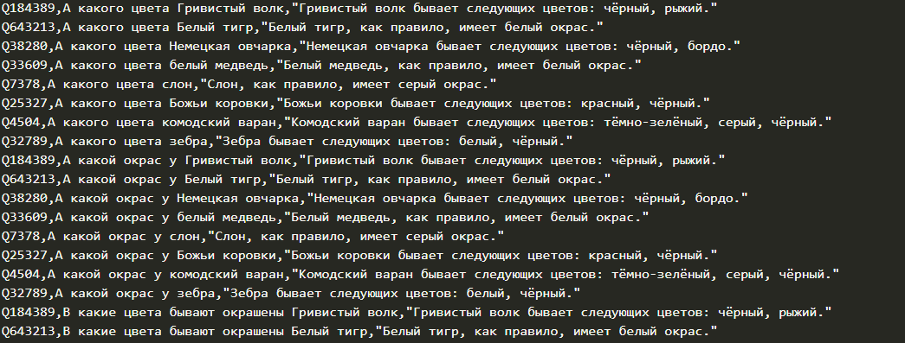

# Wikidata QID Label

wikidataqidlabels is a VS Code extension to show a description of the entity in Wikidata on hover. Currently, the plugin uses Wikidata API (https://www.wikidata.org/w/api.php).

## Features

## Requirements

No API keys or anything else required.

## Extension Settings

This extension contributes the following settings:

* `wikidataqidlabels.enableExtension`: enable/disable this extension
* `wikidataqidlabels.wikidataLanguages`: a string with required languages for labels and descriptions separated by '|'. For more information go to https://www.wikidata.org/w/api.php?action=help&modules=wbgetentities
* `wikidataqidlabels.addLinkToEntity`: whether to add a link to the entity in the hover text

### 1.0.0

Initial release of the extension

### 1.1.0

Added links to entities in hover text
How the extension works with quotes in JSON files

### 1.2.0

Fixes for entities which don't have a description
